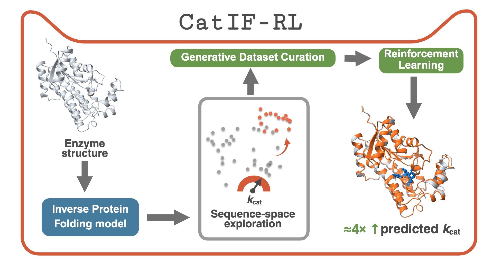

# CatIF-RL

<p align="center">
  
</p>
<p align="center"><em>Graphical abstract — sample → score → KL-regularized GRPO update over a discrete-diffusion inverse-folding policy. Full description: bioRxiv preprint <a href="https://doi.org/10.64898/2026.05.11.724288">10.64898/2026.05.11.724288</a>.</em></p>

[](https://doi.org/10.64898/2026.05.11.724288)
[](https://doi.org/10.5281/zenodo.20357062)
[](LICENSE)
[](https://www.python.org/downloads/)
[](https://github.com/lynk-101-li/CatIF-RL/actions/workflows/smoke.yml)

**Activity-Oriented Enzyme Sequence Design by Steered Inverse Protein Folding**

CatIF-RL is a reinforcement-learning framework that fine-tunes a graph-based discrete-diffusion inverse-folding policy toward enzymes with higher predicted catalytic activity. The pipeline iterates:

1. Sample candidate mutant sequences from the current policy on a fixed backbone graph.
2. Score each candidate's Δlog(*k*<sub>cat</sub>) with an ensemble of independent kinetic predictors (DLKcat, UniKP, CataPro), gated by ESMFold structural plausibility.
3. Apply KL-regularized Group Relative Policy Optimization (GRPO) against the offline reward, with a mutation-fraction penalty.

The framework comprises three sequential models trained from a shared graph-denoising-diffusion backbone:

- **EnzymeIF** — supervised adaptation of the inverse-folding prior to enzyme structural data, with CATH-derived backbones as structural regularizers.
- **CatIF** — supervised model trained from scratch on the activity-positive variant set selected by Generative Dataset Curation (GDC).
- **CatIF-RL** — KL-regularized GRPO refinement of CatIF over three iterative rounds of sample → score → train.

A discrete subgraph inpainting sampler (BLOSUM iterative-fusion variant) supports motif-preserving partial sequence redesign under fixed catalytic residues.

## Repository layout

```
.
├── catif_rl/                       # Python package (run as `python -m catif_rl.<module>`)
│   ├── config/                     # YAML training hyperparameters
│   ├── data/                       # Dataset construction (BRENDA + CATH + ESMFold)
│   ├── models/                     # GraDe-IF backbone adapter
│   ├── training/                   # EnzymeIF / CatIF supervised + GRPO RL
│   ├── sampling/                   # Inference, batch sampling, motif inpainting
│   ├── reward/                     # GDC funnel + 3-predictor ensemble + scoring
│   └── evaluation/                 # Recovery / pLDDT / RMSD / SR + statistics
├── scripts/                        # Shell entry points (numbered by pipeline stage)
├── notebooks/                      # Demos + paper-figure reproduction
├── case_study/                     # Four worked examples from the paper
├── tests/                          # Smoke tests
├── docs/                           # Installation + reproduction + algorithm walkthroughs
├── data/                           # Datasets (downloaded separately — see data/README.md)
├── checkpoints/                    # Pretrained weights (downloaded separately — see checkpoints/README.md)
├── external/                       # Upstream repositories cloned by scripts/00_setup_external.sh
├── environment.yml                 # Conda environment definition
├── requirements.txt                # Pip-only minimal install
├── LICENSE                         # MIT
└── README.md
```

## Installation

CatIF-RL was developed on Linux with CUDA 11.7 and a single RTX-class GPU.

```bash
git clone https://github.com/lynk-101-li/CatIF-RL.git
cd CatIF-RL
conda env create -f environment.yml
conda activate catif

# Clone the upstream backbone (GraDe-IF) and the three reward predictors.
# This script does NOT download model weights — see external/README.md.
bash scripts/00_setup_external.sh
```

Pip-only installs are possible (`pip install -r requirements.txt`) but require pre-installed CUDA 11.7 / OpenMM / DSSP. See `environment.yml` for the canonical pin set.

## Quick start

Run the inverse-folding demo notebook end-to-end:

```bash
jupyter lab notebooks/01_quickstart_inference.ipynb
```

Or, from the command line, generate one mutant for a held-out enzyme using a pretrained policy:

```bash
POLICY_CKPT=checkpoints/catif_rl_R3.pt \
TEST_PDB=case_study/EC1.4.1.20_Lsphaericus/native.pdb \
OUTPUT=runs/quickstart \
bash scripts/06_sample_benchmark.sh
```

Pretrained weights and processed graph datasets must be downloaded first; see `checkpoints/README.md` and `data/README.md`.

## Reproducing the paper

The full pipeline is implemented as numbered shell entry points, designed to be run in sequence:

| Step | Script | Purpose |
|------|--------|---------|
| 1 | `scripts/01_build_dataset.sh` | Build per-enzyme graph tensors from BRENDA + CATH |
| 2 | `scripts/02_train_enzymeif.sh` | Supervised pretraining of EnzymeIF |
| 3 | `scripts/03_run_gdc.sh` | Generative Dataset Curation funnel |
| 4 | `scripts/04_train_catif.sh` | Supervised CatIF training on the GDC variant set |
| 5 | `scripts/05a_rl_round1.sh` &rarr; `05b_rl_round2.sh` &rarr; `05c_rl_round3.sh` | Three GRPO rounds |
| 6 | `scripts/06_sample_benchmark.sh` | Sample all eleven baselines on the 1,423-enzyme test set (5 seeds) |
| 7 | `scripts/07_score_benchmark.sh` | Compute Δlog(*k*<sub>cat</sub>) / Recovery / pLDDT / RMSD / SR |
| 8 | `scripts/08_run_case_studies.sh` | Run the four representative cases (3 global + 1 motif-inpainting) |

See `docs/reproducing_paper.md` for expected wall-clock times and GPU requirements per stage.

## Motif-preserving inpainting

CatIF-RL ships a discrete subgraph inpainting sampler (Algorithm S1 in the manuscript Supporting Information) that fixes user-specified residues to their native identity while redesigning the surrounding sequence:

```bash
python -m catif_rl.sampling.inpaint \
  --pdb case_study/EC1.1.1.248_SalR/native.pdb \
  --mask 151,179,235,239 \
  --ckpt checkpoints/catif_rl_R3.pt \
  --u 5 \
  --output runs/salr_inpaint.fasta
```

The mask indices are 0-based; the example above corresponds to the four catalytic residues Asn152, Ser180, Tyr236, Lys240 of *Papaver bracteatum* salutaridine reductase.

## Data and pretrained checkpoints

Training data and trained policy weights are too large for git and are archived separately:

- **Pretrained weights** — see [`checkpoints/README.md`](checkpoints/README.md)
- **Processed graph tensors and reward CSVs** — see [`data/README.md`](data/README.md)
- **Underlying public sources** — DLKcat-BRENDA enzyme kinetic dataset, CATH v4.2.0 backbone library, and ESMFold-predicted structures (see `docs/dataset_construction.md`)

## Citation

If you use CatIF-RL in your research, please cite the preprint:

```
Li, Y.; Xiong, J.; Zhang, Y.; Cai, T.; Fu, C.; Li, S.; Xu, W.; Lyu, R.;
Chen, Z.; Guo, Z.; Gong, X.; Wang, F. CatIF-RL: Activity-Oriented Enzyme
Sequence Design by Steered Inverse Protein Folding. bioRxiv 2026.
DOI: 10.64898/2026.05.11.724288.
```

BibTeX:

```bibtex
@article{li2026catifrl,
  title   = {CatIF-RL: Activity-Oriented Enzyme Sequence Design by Steered Inverse Protein Folding},
  author  = {Li, Yanheng and Xiong, Jialong and Zhang, Yuxin and Cai, Tong and Fu, Chuan and Li, Shutong and Xu, Wei and Lyu, Ruoyi and Chen, Zhaoyang and Guo, Zheng and Gong, Xinqi and Wang, Feng},
  journal = {bioRxiv},
  year    = {2026},
  doi     = {10.64898/2026.05.11.724288},
  url     = {https://www.biorxiv.org/content/10.64898/2026.05.11.724288}
}
```

A peer-reviewed journal version is forthcoming — this section will be updated to point to the journal article once it is published. A machine-readable [`CITATION.cff`](CITATION.cff) is also provided so GitHub renders the "Cite this repository" button automatically.

## License

This project's source code is released under the [MIT License](LICENSE).

Several upstream components and data sources are governed by other terms:

- The graph-diffusion backbone [GraDe-IF](https://github.com/ykiiiiii/GraDe_IF) is MIT-licensed; the application wrapper `catif_rl/models/gradeif_app.py` is adapted from it with attribution.
- The [UniKP](https://github.com/Luo-SynBioLab/UniKP) kinetic predictor does not currently ship an explicit license — this repository depends on it (via subprocess only) under academic, non-commercial research conventions.
- [DLKcat](https://github.com/SysBioChalmers/DLKcat) is released under GPL v3 and is invoked here only via subprocess.
- [CataPro](https://github.com/zchwang/CataPro) is MIT-licensed.
- The training data is derived from BRENDA (CC BY 4.0 Non-Commercial); BRENDA records are **not** redistributed in this repository.

Per-component status, references, and the obligations they imply are documented in [THIRD_PARTY_NOTICES.md](THIRD_PARTY_NOTICES.md). See also `external/README.md` and `docs/external_dependencies.md` for the install-time clone instructions.

## Acknowledgments

CatIF-RL builds on GraDe-IF (graph denoising diffusion for inverse protein folding) and incorporates ideas from PiFold, ESM-IF, ProteinMPNN, LigandMPNN, and ABACUS-T as evaluation baselines. The DLKcat, UniKP, and CataPro kinetic predictors are used as the offline reward signal. We thank the authors of these projects for their open-source releases.
